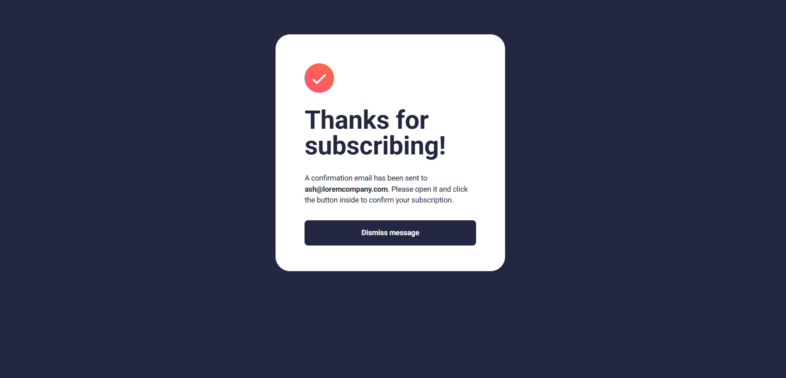

# Frontend Mentor - Newsletter sign-up form with success message solution

This is a solution to the [Newsletter sign-up form with success message challenge on Frontend Mentor](https://www.frontendmentor.io/challenges/newsletter-signup-form-with-success-message-3FC1AZbNrv). Frontend Mentor challenges help you improve your coding skills by building realistic projects. 

## Table of contents

- [Frontend Mentor - Newsletter sign-up form with success message solution](#frontend-mentor---newsletter-sign-up-form-with-success-message-solution)
  - [Table of contents](#table-of-contents)
  - [Overview](#overview)
    - [The challenge](#the-challenge)
    - [Screenshot](#screenshot)
    - [Links](#links)
  - [My process](#my-process)
    - [Built with](#built-with)
    - [What I learned](#what-i-learned)
      - [Using the `<picture>` Tag](#using-the-picture-tag)
    - [Useful resources](#useful-resources)
  - [Author](#author)

**Note: Delete this note and update the table of contents based on what sections you keep.**

## Overview

### The challenge

Users should be able to:

- Add their email and submit the form
- See a success message with their email after successfully submitting the form (I still try it.)
- See form validation messages if:
  - The field is left empty
  - The email address is not formatted correctly
- View the optimal layout for the interface depending on their device's screen size
- See hover and focus states for all interactive elements on the page

### Screenshot
- Input email and submit button

- Success message


### Links

- Solution URL: [My solution URL here](https://github.com/angel-retry/newsletter-sign-up-with-success-message-main)
- Live Site URL: [Add live site URL here](https://your-live-site-url.com)

## My process

### Built with

- Semantic HTML5 markup
- CSS custom properties
- Flexbox
- SCSS
- Mobile-first workflow
- Javascript

### What I learned
#### Using the `<picture>` Tag
This time, I specifically learned about the `<picture>` tag, which allows me to display different images without relying on CSS to specify which image appears on different devices. It's incredibly convenient!

Previously, I had to use CSS to control image display, which was quite frustrating because it required writing extra code.

Here’s a breakdown of the key points:
- The `media` attribute is used to define the display range.
- The syntax is very similar to CSS, making it easy to understand and implement.
```html
<picture>
  <source
    srcset="./assets/images/illustration-sign-up-desktop.svg"
    media="(min-width: 1024px)"
  />
  
</picture>
```

### Useful resources

- [CSS Gradient](https://cssgradient.io/) - You can use CSS gradient effects on this website and copy the CSS code .

## Author
- Github - [My Github](https://github.com/angel-retry)
- Frontend Mentor - [@angel-retry](https://www.frontendmentor.io/profile/angel-retry)
